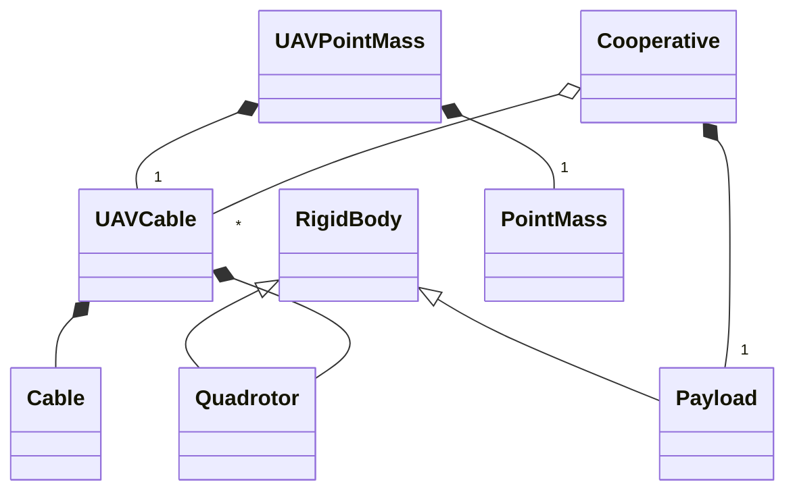

# RotorTM in CXX

## 1 Developing envir and Dependency
1. Ubuntu 18.04/20.04
2. ROS melodic/noetic
3. Boost 1.81.0
4. Eigen 3.4.0
5. CXX 17

## TODO & WokingOn
[X] a UML Class Diagram to show the relationship among all classes

[X] add "the cooperative case" that is a payload + several quadrotors

[X] use gtests to test all libs

[ ] add ros wrappers for libs

[ ] modify launch and config files to allow users better set parameters for simulation

[ ] add rviz visualization


## 2 Code structure and libs
Here explains the structure for the C++ simulator of RotorTM.

### 2.1 structure
There are three base classes:
- RigidBody
- Cable
- PointMass

two intermediate (or ?) classes:
- Quadrotor inherited from RigidBody
- MAVCable that composes one Quadrotor and one Cable

and two more simulation-case classes:
- Cooperative that contains n * MAVCable and 1 payload
- UAVPointMass that contains 1 MAVCable and 1 PointMass




They are defined as 
- lib_cable
- lib_rigidbody
- lib_pointmass
- lib_uavcable
- lib_payload
- lib_quadrotor_pointmass
- lib_cooperative_uavs_payload


## Simulater supported cases

### 3.1 case of several quadrotors + a payload (Ongoing)
### how to run
Steps to run a cooperative case, i.e. 4 quadrotors and a payload. The parameters are specified by ```<!--4 dragonfly with fedex box payload using cable mechanisms-->``` in the editable.launch.
1. roslaunch the simulator
```shell
    roslaunch rotor_tm CXX_Cooperative.launch 
```
2. call trajectory generator
      ```shell
      rosservice call rosservice call /traj_generator/Circle "radius: 1.0 T: 10.0 duration: 10.0" 
      ```   

### 3.2 case of a quadrotor + a pointmass payload

#### how to run
Steps to run the simulator of a quadrotor + a pointmass payload
1. roslaunch the simulator
      ```shell
      roslaunch rotor_tm test_DronePointMass.launch 
      ```
2. call trajectory generator
      ```shell
      rosservice call rosservice call /traj_generator/Circle "radius: 1.0 T: 10.0 duration: 10.0" 
      ```         
#### code explanation
This case mainly involves two libs: lib_quadrotor (lib_quadrotor.cpp/hpp) and lib_pointmass (lib_pointmass.cpp/hpp). Then, a ros node defined in rotorTM_node_drone_pointmass.cpp is used to begin the simulator in ROS.


### 3.3 case of a quadrotor

#### how to run
Steps to run single quadrotor dynamic simulator
1. modify test_CXXSimulator.launch file by
  - changing drone mass and interia that are defined in rotor_tm_config/config/uav_params/race.yaml as
      ```xml
      mass: 0.95
      inertia: {Ixx: 0.003, Ixy: 0.0, Ixz: 0.0, Iyx: 0.0, Iyy: 0.003, Iyz: 0.0, Izx: 0.0, Izy: 0.0, Izz: 0.004}
      ```
  - deciding topics to receive input wrench 
    - ```<remap from="reference/fm_cmd" to="/fm_cmd"/>```
    - message's type is rotor_tm_msgs::FMCommand
    - Note: 
      - the input thrust (scalar, norm of thrust force) is defined at /fm_cmd/thrust, 
      - the input torque (3X1 vector, torque in body frame) is defined at /fm_cmd/moments.
  - deciding topics to pusblish drone state
    - ```<remap from="outputs/odom" to="/odom"/>```
    - message's type is nav_msgs::Odometry
2. launch the simulator by
    ```bash
     roslaunch rotor_tm test_CXXSimulator.launch
    ```
3. Note that the ros frequency is 100Hz and quadrotor simulators's step is 0.01, but they are be chosen independently.


## Use gTests
Implement tests with gootle tests.

1. programme tests.
  test cases are defined in the folder gtest and test must be defined in CmakeLists.
    - take testQuadrotorClass for example
    - test cases are defeind in  gtest/testQuadrotorClass.cpp
    - in CMakeLists.txt
    - create a test with the name being singleUAVTest
        ```cmake
            catkin_add_gtest(singleUAVTest gtest/testQuadrotorClass.cpp)
        ```
    - link libraries to be used in this test
        ```cmake
            target_link_libraries(singleUAVTest lib_quadrotor_dynamic_simulator ${catkin_LIBRARIES} Eigen3::Eigen Boost::program_options)
        ```
2. run tests in catkin
Steps to run tests 
    - build all packages using ```catkin build```
    - run test
      1. for all packages
          ```cmake
          catkin test
          ```
      2. for one package like rotor_tm 
          ```
          catkin test rotor_tm
          ```
  
